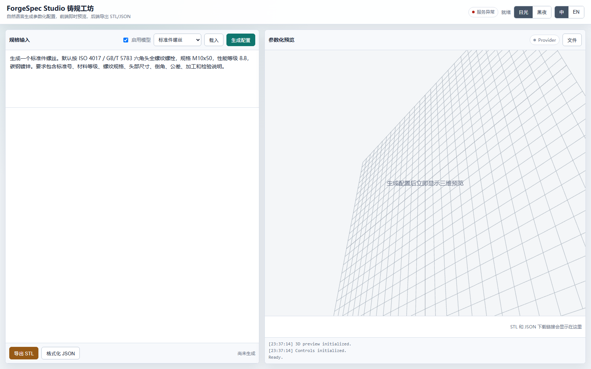

# ForgeSpec Studio

**An experiment in turning loose engineering requirements into structured, inspectable CAD source.**

The question behind ForgeSpec Studio is: how much of an AI-assisted CAD workflow can be made deterministic, reconstructable, and reviewable before geometry is exported?

The current prototype turns a natural-language brief into typed intent and an intermediate `AssemblySpec`. Python/CadQuery code then builds the geometry and writes STEP, STL, source, metadata, validation, and assurance artifacts. The model can help interpret the brief, but it does not directly become the manufacturing definition.

> Generated dimensions, materials, tolerances, fits, loads, and safety assumptions still require engineering review.



*The browser interface above is shown before generation. Built jobs populate the structured specification, 3D preview, and artifact download area.*

## Question behind the prototype

Prompt-to-CAD demos can collapse requirement interpretation, geometry generation, and the final artifact into one difficult-to-inspect step. This prototype keeps those stages separate:

```text
Natural-language engineering brief
            │
            ▼
      typed CadBrief
            │
            ▼
   intent classification
            │
            ▼
 domain planner + standards library
            │
            ▼
 deterministic AssemblySpec
            │
            ▼
 reviewable CadQuery source
            │
            ▼
 STEP · STL · preview · metadata
            │
            ▼
 validation + security + assurance report
```

In the current implementation, the source representation remains primary, standard-part assumptions stay visible, and the same intermediate specification can be modified and regenerated.

## Current design choices

- **Source-first:** every build writes runnable CadQuery source alongside derived geometry.
- **Deterministic execution:** the LLM can propose intent; geometry is produced from a validated schema and stable generator families.
- **Standards-backed parts:** local catalog data expands common fasteners without asking the model to invent dimensions.
- **Typed planning:** single parts, standard parts, assemblies, robot descriptions, and inspection tasks remain distinct.
- **Reviewable assumptions:** material, tolerance, interfaces, standard references, and decomposition are represented in `AssemblySpec`.
- **Job-scoped artifacts:** each build gets its own manifest, assurance report, source snapshot, and exports.
- **Security-gated source:** AST checks reject banned imports and unsafe generated-source patterns before source builds execute.

## Standards library

The initial catalog in [`standards/fasteners.json`](standards/fasteners.json) covers common metric fasteners. For example, a brief such as:

```text
Generate a standard M10 × 50 fully threaded hex-head bolt, class 8.8.
```

can be expanded into an ISO 4017 / GB/T 5783-backed part with thread pitch, thread length, head dimensions, material assumptions, tolerances, and inspection notes. The catalog is intentionally local and inspectable. Future entries can add washers, nuts, pins, bearings, keys, and other mechanical components without changing the planning contract.

## Outputs

A successful build can return:

| Artifact | Role |
| --- | --- |
| `.step` | Primary exchange geometry for engineering review |
| `.stl` | Secondary mesh export and preview input |
| `.py` | Runnable CadQuery source snapshot |
| `.json` | Typed `AssemblySpec` and metadata |
| `.svg` | Lightweight generated preview |
| `manifest.json` | Job identity and artifact provenance |
| `assurance_report.json` | Validation, warnings, and source-security result |

The project does not claim that the presence of these files proves manufacturability or fitness for service.

## Quick start

```bash
git clone https://github.com/12sqawdwq/ForgeSpec-Studio.git
cd ForgeSpec-Studio

conda env create -f environment.yml
conda activate gencad_gemini

cp .env.example .env
# Add a provider key only if model-assisted planning is required.
./run.sh
```

Open <http://127.0.0.1:8000/>. Deterministic fallback planning works without sending a prompt to a model; configured providers are tried in `LLM_PROVIDER_ORDER`.

### Configuration

```dotenv
LLM_PROVIDER_ORDER=zhipu,gemini
ZHIPU_API_KEY=PASTE_YOUR_ZHIPU_API_KEY_HERE
ZHIPU_MODEL=glm-4.5-flash
GEMINI_API_KEY=PASTE_YOUR_GEMINI_API_KEY_HERE
GEMINI_MODEL=gemini-2.5-flash
```

Copy [`.env.example`](.env.example) rather than editing it. `.env` is ignored by Git and must never be committed. Optional outbound proxy variables are documented in the example file.

## API

| Method | Endpoint | Purpose |
| --- | --- | --- |
| `GET` | `/api/health` | Service health |
| `POST` | `/api/generate-config` | Brief-to-plan/specification |
| `POST` | `/api/build` | Deterministic artifact build |
| `GET` | `/api/files` | Recent job artifacts |
| `POST` | `/api/validate-source` | Static source-security gate |
| `POST` | `/api/build-source` | Build an accepted source package |
| `GET` | `/api/jobs/{job_id}/assurance-report` | Job validation evidence |

## Validation and tests

The test suite covers:

- brief, intent, and planner behavior;
- standard-part expansion and taxonomy preservation;
- target-drift guardrails for assemblies;
- schema normalization;
- FastAPI health/generation/build endpoints;
- source-security rejection paths;
- STEP/STL/JSON/source/manifest/assurance artifact generation when CadQuery is available;
- regression prompts in [`tests/regression/prompts.jsonl`](tests/regression/prompts.jsonl).

Run:

```bash
pytest -q
```

Tests that require CadQuery use explicit dependency checks. A passing planner-only subset is not equivalent to a passing geometry-export suite; report skipped tests with the result.

## Repository structure

```text
app.py                 FastAPI service and browser entry point
brief.py               engineering brief extraction
intent.py              typed task classification
planner.py             domain planning and decomposition
schemas.py             AssemblySpec and part contracts
standard_library.py    local standards-backed expansion
cad_source.py          reviewable CadQuery source rendering
cad_engine.py          deterministic geometry and export
validation.py          generated-artifact checks
source_security.py     AST-based source policy
assurance.py           manifests and assurance reports
standards/             local engineering catalog data
static/                responsive browser UI
tests/                 API, planning, security, and geometry tests
docs/                  architecture direction and interface evidence
```

See [`docs/architecture-roadmap.md`](docs/architecture-roadmap.md) for design references, non-goals, and the staged pipeline direction.

## Current limitations

- The local standards catalog is intentionally small and does not replace a controlled enterprise parts library.
- Geometry validation currently checks structural properties and artifacts; it is not FEA, tolerance-stack, fatigue, or design-code verification.
- Assembly placement is planning-oriented and does not yet provide a full constraint/mating solver.
- Provider output quality varies. Deterministic fallback templates cover only supported generator families.
- Generated source is policy-checked, but source execution should still occur in an appropriately isolated environment.
- No generated artifact should be manufactured without dimensional, material, load, tolerance, and safety review.

## Deployment

The included `gencad-gemini-studio.service` is a user-service example. Replace its project path, keep the application behind a conventional TLS reverse proxy, and store provider credentials in deployment secrets rather than in the repository.

## License

[MIT](LICENSE).
